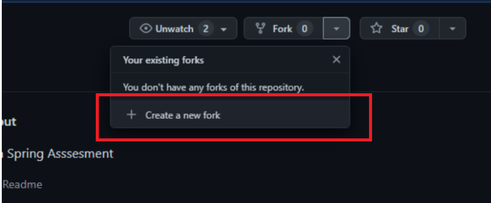
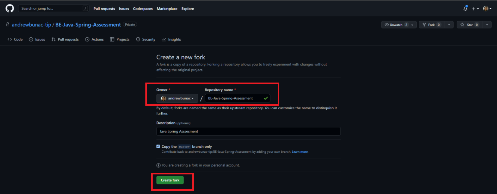
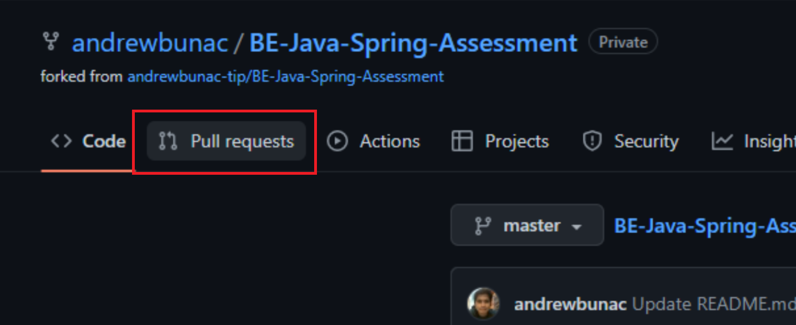
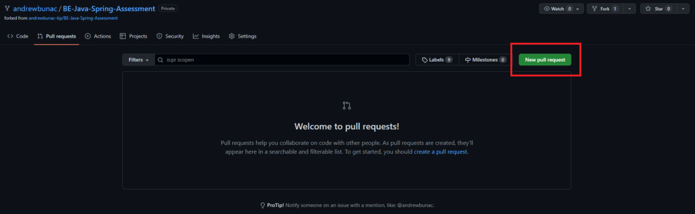
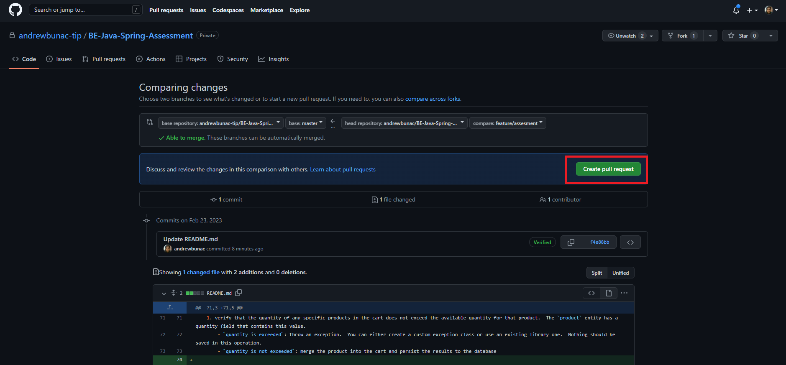
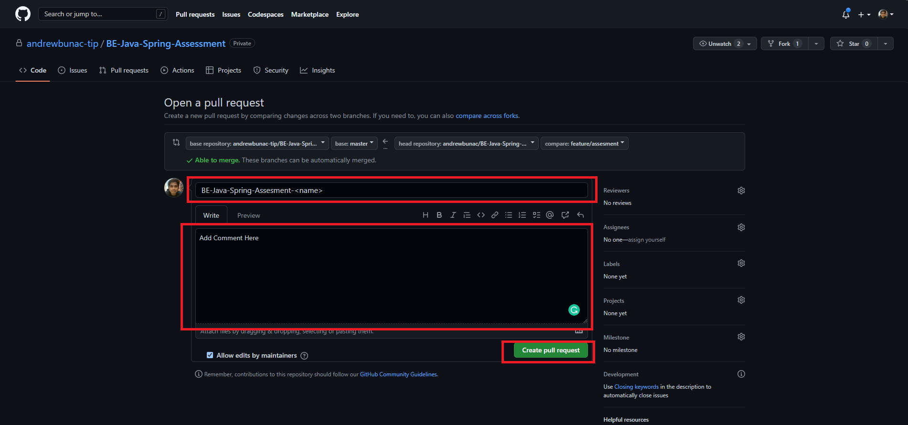

# BE-Java-Spring-Assessment

## Prerequisites
1. This project is a web-server built using the Java Spring Framework
1. To complete run and test the server you will at a minimum need the following software:
    - Linux or Unix OS (the submission will be tested on this)
    - Java 8 (if you want to use a later version then you will need to update the POM.xml)
    - git
    - maven
    - docker
    - Postman (recommended), curl, or some other tool to test REST APIs with GET/POST/PUT

## Instructions
1. Fork this repo as a public repo.
    - 
    - 

2. Pull your repo locally.
3. Branch into a feature branch.
4. Develop according to the Acceptance Criteria below on the feature branch. There is no time limit, but this task should not take long.
5. Googling is allowed.
6. When ready to submit, push the feature branch to your public repo.
7. Open a PR from the feature branch to the main branch.
    - 
    - 
    - 
    - 
8. Share the link to your public repo with us.
9. Please contact us if you have any issues or difficulty with this code base.
10. Examine the project architecture.  The project is a functioning server, but it is in no way an optimized one.  Consider what inefficiencies or issues may exist in the project.  You may be asked technical questions about this project in further interviews. Feel free to add any additional features or optimizations beyond the requirements if you wish, but you are not required to do so.

## Server Information
### Docker:
1. The server contains a docker-compose file that will create a mysql instance required to run the server.  Use these instructions to get mysql running:
    - Open a new terminal window and navigate to the project folder: [cartService/](cartService/)
    - run the command `docker-compose up`
    - this must remain running when you want to run the Java Server

### Maven:
1. We are using maven to build and run the server.  Use the following instructions to build or run the server
    - Open a new terminal window and navigate to the project folder: [cartService/](cartService/)
    - Build: `mvn clean install` - this command will install any required dependencies and build the server.
    - Run: `mvn spring-boot:run` - this command will build & run the server

### Server REST API:
1. the server exposes the following endpoints:
    - `GET` [http://localhost:9000/cartService/product](http://localhost:9000/cartService/product) - this should return JSON of all products stored in the database
    - `POST` [http://localhost:9000/cartService/product](http://localhost:9000/cartService/product) - a POST with JSON for a product will either update an existing product if the correct `id` is sent in the json, or it will create a new product if the `id` is omitted or does not correspond to an existing record.
    - `GET` [http://localhost:9000/cartService/cart](http://localhost:9000/cartService/cart) - this should return JSON of all carts stored in the database
    - `POST` [http://localhost:9000/cartService/cart](http://localhost:9000/cartService/cart) - a POST with JSON for a cart will either update an existing cart if the correct `id` is sent in the json, or it will create a new cart if the `id` is omitted or does not correspond to an existing record.

### Example JSON
1. The [cartService/src/main/resources/json-examples](cartService/src/main/resources/json-examples) directory contains example JSON that should work with the API.
1. The project will automatically load the json for product_1.json, product_2.json, and cart_1.json upon initial start up for convenience.
    - [product_1.json](cartService/src/main/resources/json-examples/product_1.json) - this json will create a new product. Use this as a template for creating other products.
    - [product_2.json](cartService/src/main/resources/json-examples/product_2.json) - this json will create a new product. Use this as a template for creating other products.
    - [product_1_update.json](cartService/src/main/resources/json-examples/product_1_update.json) - this json will update the product stored in the database with an id of 1.
    - [cart_1.json](cartService/src/main/resources/json-examples/cart_1.json) - this json will create a new cart that contains products 1 and 2.  Use this as a template for creating other cart submissions
    - [cart_1_update.json](cartService/src/main/resources/json-examples/cart_1_update.json) - this json will update the cart stored in the database with an id of 1.

## Acceptance Criteria
- For this project you will need to finish the implementation for submitting cart json to the server.  It currently functions at a very basic level.
- [CartServiceImpl.java](cartService/src/main/java/com/assessment/cartService/service/impl/CartServiceImpl.java) - you will need to update the `submitCart()` method in this class.  You can any additional methods for your implementation that you wish.
- The requirements for this method are:
    1. check if the submitted cart exists in the database already
        - `cart does not exist`: create a new cart and persist it to the database
        - `cart exists`: fetch the persisted cart from the database and merge the products lists, note that the list should allow multiple copies of an individual product
    1. verify that all products in the cart exist in the database
        - this will require the use of the `ProductServiceImpl` which is currently not exposed in the `CartServiceImpl` class.  You will need to add this dependency and then use that service to access the products.  Look at the [CrudService](cartService/src/main/java/com/assessment/cartService/service/CrudService.java) interface to see what methods are exposed by the `ProductServiceImpl` and `CartServiceImpl`.
        - `product does not exist`: throw an exception.  You can either create a custom exception class or use an existing library one.  Nothing should be saved in this operation.
        - `product exists`: merge the product into the cart and persist the results to the database
    1. verify that the quantity of any specific products in the cart does not exceed the available quantity for that product.  The `product` entity has a quantity field that contains this value.
        - `quantity is exceeded`: throw an exception.  You can either create a custom exception class or use an existing library one.  Nothing should be saved in this operation.
        - `quantity is not exceeded`: merge the product into the cart and persist the results to the database
